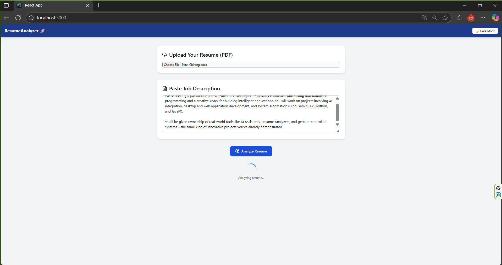
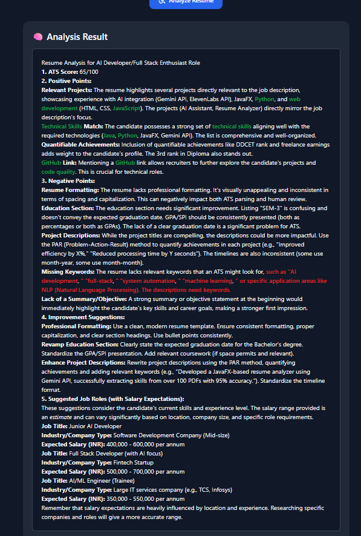
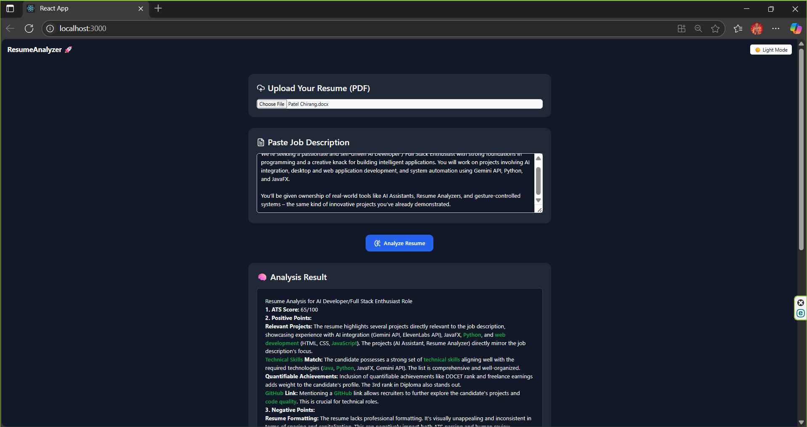

# ResumeAnalyzer 🚀

A full-stack application that analyzes your resume against a job description using AI and keyword matching.

---

## 📸 Screenshots

### 🔍 Home Page


### 🧠 Analysis Result


### 🌙 Dark Mode


---

## ✨ Features

- 🧠 AI-powered resume and job description analysis  
- ✅ Highlights matching and missing keywords  
- 🌙 Light/Dark mode toggle  
- 📥 Upload PDF, DOCX, JPG, JPEG, PNG resume  
- ⚡ FastAPI backend with React frontend  
- 📊 Visual analysis results with colored highlights  

---

## 🛠️ Technologies Used

### Frontend
- React  
- TailwindCSS  
- Lucide Icons  
- Markdown rendering with `marked`

### Backend
- FastAPI  
- Python  
- PyPDF2 / resume parsing logic  

---

## 🧪 How to Run Locally

### 📦 Backend Setup

1. Navigate to backend folder:
   ```bash
   cd resumeanalyzer
   ```

2. *(Optional but recommended)* Create virtual environment:
   ```bash
   python -m venv venv
   venv\Scripts\activate  # For Windows
   ```

3. Install dependencies:
   ```bash
   pip install -r requirements.txt
   ```

4. Start FastAPI backend:
   ```bash
   uvicorn main:app --reload
   ```

---

### 💻 Frontend Setup

1. Navigate to frontend folder:
   ```bash
   cd resume-analyzer-ui
   ```

2. Install Node packages:
   ```bash
   npm install
   ```

3. Start React dev server:
   ```bash
   npm start
   ```

4. App runs at:  
   [http://localhost:3000](http://localhost:3000)

---

## 🚀 Deployment *(Coming soon)*

- GitHub Pages / Netlify for frontend  
- Render / Railway / Vercel for backend

---

## 📄 License

MIT License © 2025 **Chirang Patel**

---

## 🤝 Contributions

Pull requests welcome! Suggestions, ideas, and issues are also appreciated.

---

## 💾 Save and Commit

To save and push this README:

```bash
git add README.md
git commit -m "📝 Add project README"
git push
```

Or use GitLens ➕ to stage → commit → push.
